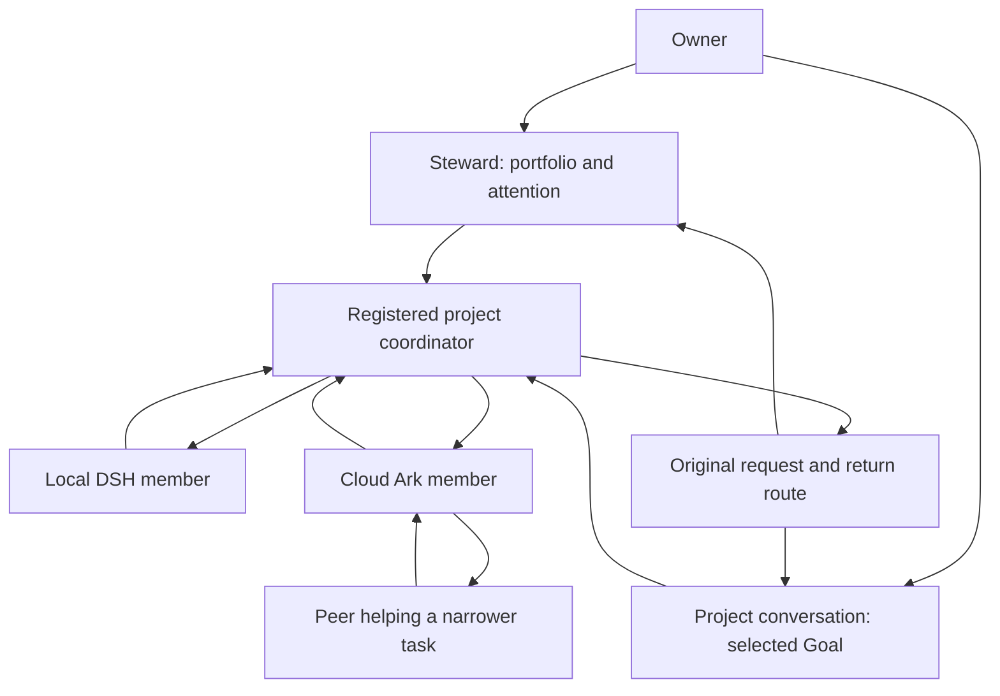

# Steward, coordinator and project conversations

The steward serves a person across projects. A project coordinator is a registered
Agent accountable for delivery within a Goal or delegated work scope. Both can
investigate and coordinate; neither role is a new scheduler or an authority rank.

| Dimension | Local steward | Project coordinator |
| --- | --- | --- |
| Commitment | Preserve owner intent, cross-project priorities and attention | Advance the accepted objective, investigate, integrate dependencies and deliver |
| Context | Bounded portfolio and owner preferences; drill into relevant projects | Current project evidence, work graph, constraints, acceptance and team commitments |
| Typical decisions | Which project needs attention; which tradeoff needs the owner | What to investigate next; who can help; whether an artifact is usable; when to replan |
| Return | Meaningful outcomes, exceptions and decisions across projects | Accepted artifacts, synthesis, remaining uncertainty and concrete blockers |
| Lifetime | Persistent relationship with the owner | Lifetime of the Goal/work commitment, independent of a replaceable host session |

A coordinator can also perform substantive research or engineering. A member may
coordinate a narrower subproblem using the same operations. Hierarchy describes
work/request dependencies; it does not permit impersonating another peer, taking
its lease, changing shared acceptance, or inheriting the steward's host grant.
The same person may talk directly to a coordinator without going through the
steward, and the same Agent can have different responsibilities in separate scopes.



The graph describes responsibility, not a command sequence. Agents choose the
work and collaborations. Hosts execute admitted actions and recover receipts.
Results return to the route that actually originated each request, not both
conversations. Cloud/DSH execution requires its separately authorized binding.

## Shared capabilities and independent axes

Reuse the existing registered identity/profile, attached-session and managed
execution adapters, peer inbox/request/adoption/return, Turn journal, canonical
Todo/claim/lease/quota, and TS acceptance owners. Keep these axes independent:

- **Responsibility:** owner-facing steward, project integration or a particular
  investigation; an advisory profile is not a permission grant.
- **Scope:** authorized Goals, resources, requested effects and return audience.
- **Host and execution:** attached existing session, governed managed Turn or an
  explicitly selected native Goal driver. Two drivers cannot co-own one binding.
- **Model/profile:** provider, model, effort, tool availability and runtime limits;
  a model name is neither a coordinator identity nor evidence of readiness.

Manager machine settings continue to configure only the steward. Choosing a
project Chat endpoint does not inherit `trusted_owner`, the steward's model or
its cross-project evidence sources. Actual project Agents retain their own
execution profiles and independently verified runtime capabilities.

This is not yet per-project provider configuration. Ordinary Goal Chat defaults
to the Codex endpoint unless the caller selects another endpoint. Its Codex
model, provider and effort come from the Chat service's configured Codex home;
the steward supplies its separate machine-configured model/effort overrides.
Both Codex conversation types share that service-level provider/login selection.
Changing it affects new Codex conversations; existing home-bound sessions cannot
silently resume under another home. Registered members' own execution profiles
are separate from this conversation runtime.

## Current local product path

Select an existing Goal and use its bottom message composer, including while
viewing tasks; replies open in place. **View reply** opens the latest answer directly,
clearing any nested execution-record filter. **Chat** opens the full history.
Ask about its current work or explicitly
ask to pass a correction to a named registered member. Project Chat now uses the
same evidence and semantic handoff path as the steward, bounded to that Goal:

1. The host classifies the stored Session's exact channel and Goal identity.
   Local project turns read only that Goal. Codex gets `loopx_context_read`;
   prompt-only adapters receive bounded evidence inline. Existing manager threads
   retain `loopx_manager_read` and their portfolio scope.
2. A `context_handoff` can select only a currently registered member of that
   Goal. The original owner message and semantic brief enter the existing inbox.
   The receiver reviews it using `manager-inbox read`, records its decision, and
   can request a peer's help with the original request as parent.
3. A receiver conclusion published through `manager-inbox report` returns to the
   original project conversation. Existing transcript IDs and return receipts
   deduplicate retry/restart. It does not open a replacement user conversation or
   require a second question.

The Chat endpoint is a conversation runtime, **not** the registered coordinator.
It does not attach to that Agent's original session, run a worker merely by
delivering a message, or take over its Goal. Inbox delivery, receiver adoption,
work completion and artifact acceptance remain distinct. The optional
[local delegation](local-delegation.md) interface from #4688 supplies separately
bound execution; this conversation change does not silently activate it.

Minimal receiver readback, using the same registry/runtime as the Chat service:

```sh
loopx --registry REGISTRY --runtime-root RUNTIME manager-inbox read \
  --goal-id GOAL --agent-id REGISTERED_AGENT
loopx --registry REGISTRY --runtime-root RUNTIME manager-inbox status \
  --goal-id GOAL --agent-id REGISTERED_AGENT --request-id REQUEST
```

After independently handling the request, the receiver uses the existing
`acknowledge`, `link` and `report` commands as appropriate; see
[context delivery](../../loopx/capabilities/manager_context/README.md).
These commands do not themselves prove the research or engineering result.

### Compatibility and limits

This intentionally adds scoped evidence and handoff to ordinary local Goal Chat;
previously only the steward had this path. Existing Goal Chat upstream sessions
are refreshed once with visible history when reopening their upstream session
so the new tool actually exists. Healthy in-process adapters and their active
Turns are retained. The
LoopX Session/return route survives. The steward's changed role instructions use
its existing context-version refresh. Unrelated model settings do not change.

An exact Goal channel is not evidence that every incoming message is private.
Lark inputs using a bound Goal session do not receive the local-owner evidence
reader or handoff grant; a preceding local Turn's handler is cleared. External
inputs calling the still-declared project tool receive
`conversation_scope_unavailable`, not a host-approval request. External
manager audiences continue to require their existing sender/resource grants.
A deliberately bound Goal session still shares its existing conversation history;
clearing a tool handler does not erase prior model context or create a private
subconversation. Bind such sessions only to an audience permitted to see that
Goal and its conversation. This slice does not qualify new Lark Goal handoff or
broaden an audience.

No new configuration or UI navigation is introduced. Project Chat now shares
the steward's active-session refresh for asynchronous returns. The existing
message stream, return status and history display the result without a reload. Closing a
conversation disables its new returns until the original route can be recovered;
it is not worker cancellation. Roll back the code to stop new project handoffs;
retain persisted inboxes and routes, and use receiver status/read commands to
reconcile outstanding work. Do not copy results into a different audience or
delete them to clear a delivery state.

## Implementation order after this slice

These are existing R2/R3/R4/R6 responsibilities, not another orchestration program:

1. **Reusable creation and execution profiles:** resolve existing identity versus
   authorized creation, bind actual model/tool limits, and report readiness.
   Preserve existing attached coordinators; no substitute session masquerading
   as the original Agent.
2. **Persistent coordinator continuity and governed work derivation:** reuse
   Turn/supervisor and Todo/amendment owners. Agent decisions choose the next
   work; host services admit, wake and recover it. Stop/revocation fences old
   executors while unrelated peers continue.
3. **Inbox, queue and steer:** share message identity and receipts, expose actual
   host support, and keep durable receipt, next-turn scheduling and current-turn
   correction distinct. Never silently translate steer into interrupt/restart.
4. **Full product qualification:** a local project coordinator runs mixed/nested
   DSH/Ark work for two cycles, adopts exact artifacts, handles owner correction
   and reconnects after failure. The steward receives meaningful portfolio
   outcomes; it does not relay every peer message. Qualify frontend and authorized
   Lark paths separately. Independent-host service/budget qualification remains R6.

## 中文：怎么理解和使用

管家对“你和多个项目”负责；项目 coordinator 对“一个目标的实际交付”负责。
前者需要知道什么时候找你、跨项目如何取舍，后者需要深入材料和证据，决定下一步
研究什么、找谁协作、拒绝哪份产物、如何综合。coordinator 本身也做实质工作。
成员协调更小的子问题时，仍使用普通 peer 的身份与协作能力，不升级成全局管家。

本次先补齐本地入口：在现有项目“对话”里查看当前工作、把补充或修订交给该 Goal
的具体成员，处理结论自动回到这段对话。无需先跳回管家，也没有另一个团队账本。
全局管家的跨项目视角保持独立。范围由宿主保存的会话身份和真实来源决定，不能靠
模型写一句“我是负责人”扩大。项目对话也不继承管家的模型设置或主机权限。

在项目任务页底部也能直接输入，回复就地展开；“对话”页用于看完整历史。
例如：“按当前证据列出各成员的下一步，区分旧记录和仍待核验的情况”；或明确说
“把以下补充交给成员 X，处理结论回到这里”。后者是收件箱投递，实际接收与执行
仍需成员自己的运行入口。

模型配置只做到部分独立：项目 Chat 默认选 Codex，也可选择其他执行器。
管家有独立的模型/推理强度设置；项目 Codex Chat 读取 Chat 服务所选 Codex home
中的默认值。两者共用服务级 provider/登录选择，目前没有逐项目 provider 设置。
项目成员自己的执行 profile 仍然独立；项目 Chat 不等于这些成员的原会话。

这不等于项目 Chat 已变成原投研 coordinator：原 Agent 的身份、会话和工作承诺
仍由原来的绑定拥有。此次收件不会自动启动执行，也不承诺 queue/steer；下一步按
上面的顺序复用创建/profile、持续执行、工作派生和三种通信能力，再完成两轮真实
混合团队验收。单次消息往返不能代替持续自主协作的资格。
